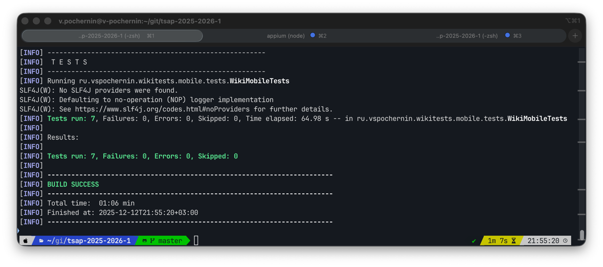

# tsap-2025-2026-1

Итоговый проект «Автоматизированные тесты для веб- и мобильного приложения» по дисциплине "Тестирование сервисов и
приложений". 1-й семестр 2-го курса МИФИ ИИКС РПО (2025-2026 уч. г).

## Описание проекта

Репозиторий содержит автотесты для:

- Веб-сайта RU Википедии (https://ru.wikipedia.org) - UI тесты на основе Selenium + TestNG.
- **TODO**: Мобильного приложения Википедии для Android (org.wikipedia) - UI тесты на основе Appium + TestNG.

Проект организован как тестовый:

- Используется Page Object для ключевых страниц (экранов).
- Написаны базовые классы для веб- и мобильных тестов.
- Некоторые тесты параметризованы через DataProvider.

## Стек технологий

- Язык: Java 21.
- Сборщик: Maven.
- Фреймворк для тестирования: TestNG.
- Тестирование веб-сайта: Selenium WebDriver, WebDriverManager, Google Chrome.
- Тестирование мобильного приложения: Appium Java Client, Appium Server, Android Emulator (AVD, Android OS).

## Тестирование веб-сайта

### Требования к окружению

- JDK 21.
- Maven (3.x).
- Google Chrome.
- Доступ в интернет.

### Запуск тестов

1. Клонировать репозиторий и перейти в него.
2. Собрать проект и запустить тесты веб-сайта командой:

```bash
mvn test -Dtest=WikiWebTests
```

При запуске Maven скачает все необходимые зависимости, WebDriverManager скачает и настроит подходящий драйвер для Google
Chrome, а тесты начнут запускаться в открывшемся окне браузера.

### Структура кода

- Веб Page Object классы находятся в пакете `ru.vspochernin.wikitests.web.pages`.
- Веб тесты находятся в пакете `ru.vspochernin.wikitests.web.tests`.

### Реализованные веб сценарии

1. Поиск статьи по точному названию (3 запуска через DataProvider).
2. Поиск по неточным запросам (3 запуска через DataProvider).
3. Переход к случайной статье.
4. Переход на конкретную статью и переключение языка на английский.

### Скриншот пройденных тестов


## Тестирование мобильного приложения

### Требования к окружению

- JDK 21 (важна именно 21+ версия Java).
- Maven.
- Node.js (для установки Appium).
- Драйвер uiautomator2 для Appium.
- Android Studio (эмулятор).
- Запущенный эмулятор Android-устройства (AVD).
- Установленое приложение Wikipedia для Android (APK с пакетом org.wikipedia, лучше всего скачать с F-Droid, чтобы была
  стабильная версия).
- Запущенный Appium Server.
- Доступ в интернет.

### Подготовка Android-окружения

1. Установить Android Studio.
2. Через Device Manager создать эмулятор устройства (лучше выбрать последний Android и современное устройство).
3. Запустить эмулятор.
4. Установить Appium (`npm install -g appium` и драйвер UiAutomator2 (`appium driver install uiautomator2`).
5. Скачать APK Wikipedia и установить (`adb install /path/to/file.apk`).

### Запуск тестов

1. Клонировать репозиторий и перейти в него.
2. Запустить Appium Server (командой `appium`).
3. Собрать проект и запустить тесты веб-сайта командой:

```bash
mvn test -Dtest=WikiMobileTests
```

Maven также скачивает все необходимые Java зависимости и запускает тесты. Тесты выполняются на эмуляторе, используя
Appium Java Client и драйвер UiAutomator2.

### Структура кода

- Мобильные Page Object классы находятся в пакете `ru.vspochernin.wikitests.mobile.pages`.
- Мобильные тесты находятся в пакете `ru.vspochernin.wikitests.mobile.tests`.

### Реализованные мобильные сценарии

1. Запуск приложения, пропуск онбординга (неявно), отображение строки поиска.
2. Поиск по ключевым словам и проверка наличия результатов.
3. Поиск по ключевым словам с открытием первого результата поиска и проверкой заголовка статьи.

В мобильных тестах важным моментом реализации является пропуск онбординга, закрытия появляющегося окна (онбординга одной из фич мобильной Википедии) и реализация возврата приложения на главный экран перед запуском очередного теста.

### Скриншот пройденных тестов



**TODO**.
