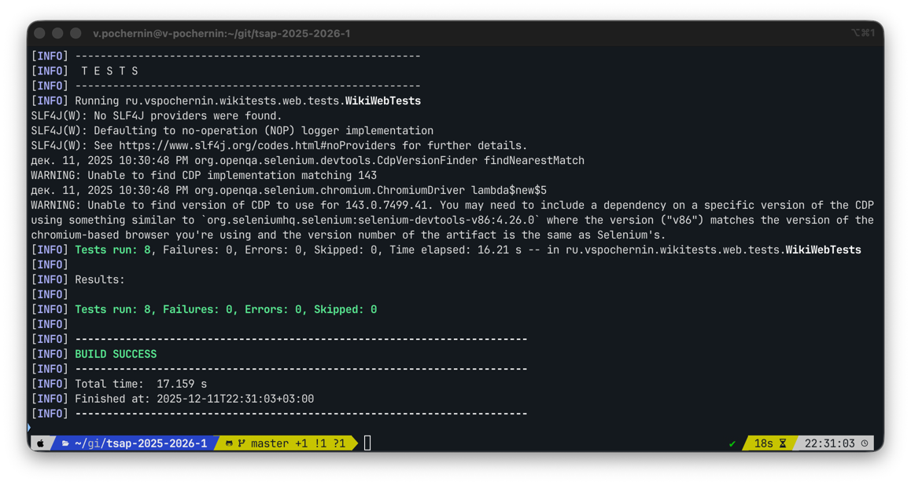

# tsap-2025-2026-1

Итоговый проект «Автоматизированные тесты для веб- и мобильного приложения» по дисциплине "Тестирование сервисов и приложений". 1-й семестр 2-го курса МИФИ ИИКС РПО (2025-2026 уч. г).

## Описание проекта

Репозиторий содержит автотесты для:

- Веб-сайта RU Википедии (https://ru.wikipedia.org) - UI тесты на основе Selenium + TestNG.
- **TODO**: Мобильного приложения Википедии для Android - UI тесты на основе Appium + TestNG.

## Стек технологий

- Язык: Java 21.
- Сборщик: Maven.
- Фреймворк для тестирования: TestNG.
- Тестирование веб-сайта: Selenium WebDriver, WebDriverManager, Google Chrome.
- Тестирование мобильного приложения: **TODO**.

## Тестирование веб-сайта

### Требования к окружению

- Установленный JDK 21.
- Установленный Maven (3.x).
- Установленный Google Chrome.
- Доступ в интернет.

### Запуск тестов

1. Клонировать репозиторий и перейти в него.
2. Собрать проект и запустить тесты веб-сайта:
```bash
mvn test -Dtest=WikiWebTests
```

При запуске Maven скачает все необходимые зависимости, WebDriverManager скачает и настроит подходящий драйвер для Google Chrome, а тесты начнут запускаться в открывшемся окне браузера.

### Реализованные веб сценарии

1. Поиск статьи по точному названию (3 запуска через DataProvider).
2. Поиск по неточным запросам (3 запуска через DataProvider).
3. Переход к случайной статье.
4. Переход на конкретную статью и переключение языка на английский.

### Скриншот пройденных тестов



## Тестирование мобильного приложения

**TODO**.
